# Práctica obligatoria: Galería de arte

*Rubén García*
*Octavio Jiménez*
*José Luis Notario*
*Dalia Ortiz*

## Problema

En la red de galerías de arte JDWS de Europa llevamos casi tres décadas ofreciendo exposiciones de pintura contemporánea de los artistas más relevantes del panorama nacional en todas partes del continente. La red de galerías fue fundada en el año 1985 y desde entonces se celebran exposiciones mensuales tanto de jóvenes talentos como de pintores consagrados.
Cada galería de arte JWD es muy exclusiva y permite exponer obras muy diversas y de autores reconocidos. Cada galería tiene una razón social y ubicación distintas.

Cada obra solo se expone en una sola galería, siempre es la misma.

La compañía ha contratado a tu empresa para empezar a automatizar tareas que antes hacían en papel y prefieren hacer utilizando software, para ello te solicitan una aplicación que permita al galerista (usuario de la aplicación):
1. Visualizar las obras de arte existentes en su galería. Permite conocer todas las obras que se exponen.
2. Dar de alta una nueva obra de arte en su galería.
3. Modificar los datos de una de las obras de arte expuestas. (El usuario debe indicar qué obra quiere visualizar).
4. Visualizar los datos de una de las obras de arte expuestas (El usuario debe indicar qué obra quiere visualizar).
5. Obtener el precio de venta de una de las obras de arte expuestas (El usuario debe indicar qué obra quiere visualizar).
6. Imprimir una etiqueta para clasificar una de las obras expuestas y dar información adicional a los visitantes de la galería (El usuario debe indicar qué obra quiere visualizar).
7. El sistema permite cargar un fichero con las obras de arte de la galería para inicializar el sistema, esta opción solo se ejecutará una vez.
8. El sistema también permitirá exportar a fichero las obras de arte.

Formato de la información contenida en el fichero:

| ID | Nombre | Autor | Tipo | Precio € | Altura m | Peso T | Piezas | Descripción |
|--|--|--|--|--|--|--|--|--|
|001|Guernica|P. Picasso|Óleo|1000|5|2|5|Cuadro de la guerra civil|
|002|La Vie|P. Picasso|Óleo|200|1|1|1|Óleo|
|003|El Sueño|P. Picasso|Óleo|300|1.3|1|1|Óleo|
|004|Retrato de Dora Maar| P. Picasso|Óleo|400|1|0.8|1|Óleo|
|005|El Piel Roja|U. Checa|Escultura|350|1|0.8|1|Escultura|

Esta tabla representa la información que debe tener el fichero y su estructura, no significa que la información esté cargada en formato tabla sino que:

- Obra 001
  - Nombre: Guernica
  - Autor: P. Picaso...

El alumno deberá pensar en la forma más adecuada de almacenar y recuperar esta información y justificar su decisión.

### Dar de alta una obra de arte

El sistema preguntará al galerista y, almacenará, los siguientes datos de una obra de arte:

- **ID de la obra** (autoincremental)
- **Tipo**
- Nombre
- Autor **(comprobar que exista en la base de datos)**
- Precio en Euros
- Altura en metros
- Peso en toneladas
- Material (solo para las esculturas: acero, cobre, hierro...)
- Técnica (solo para las obras pictóricas: óleo, acuarela, carboncillo...)
- Número de piezas
- Descripción
- Galería

### Visualizar los datos de la obra de arte expuesta

Se mostrará el número de serie y peso de la máquina dada de alta.

```bash
Nombre: El Guernica
Autor: Picasso
Precio(€): 999999
Altura (m): 5
Peso(t): 1
Número de piezas: 5
Descripción: El mural «Guernica» fue adquirido a Picasso por el Estado español en 1937.

```

### Obtener el precio de venta de la obra de arte

El precio de venta se calcula incrementando un 25% el precio original, que es la comisión que se lleva la galería.
Para cada pieza de la obra se cobrará transporte:
- Si pesa más de 1 kg se cobrará 100 €, en caso contrario solo 20€
- Si la altura es mayor de 2 metros se cobrará 100€ por pieza, en caso contrario solo 20
- Si una pieza tiene más de 2 partes, se cobrará un gasto adicional de 10€ por pieza **adicional**.
  
Se mostrará el precio en Dólares (ratio de conversión 1 dólar es 0,99€).
Conceptos particulares del precio:
- Obras de tipo pictórica:
  - Tienen un descuento del 10%
- Obras de tipo escultura:
  - Tienen un descuento del 20%
  - Tienen un sobrecoste de 50€ por gastos de manipulación

```bash
Nombre: El Guernica
Altura (m): 5
Peso(t): 2
Número de piezas: 5
Precio(€): 100
Comisión Galería(€): 25
Importe por peso(€): 20
Importe por altura(€): 100
Importe adicional - Pieza 3 (€): 10
Importe adicional - Pieza 4 (€): 10
Importe adicional - Pieza 5 (€): 10
Precio de venta(€): 275
Descuento (10% óleo €): 27,5
Precio de venta($): 247,5
```

### Imprimir una etiqueta

Se imprimirá (por pantalla) la siguiente etiqueta:

```bash
Nombre: El Guernica
Autor: Picasso
Descripción: El mural «Guernica» fue adquirido a Picasso por el Estado español en 1937.
```

### Entornos de desarrollo:

- Análisis del problema: Requisitos funcionales, no funcionales, Casos de Uso, Diagramas de actividad (25% de la calificación)
- Diseño de la solución: Arquitectura, Diagrama de componentes, Diagrama de Paquetes, Diagrama de clases, Diseño de las pruebas, Prototipo, Diseño de los ficheros de intercambio de datos (qué lenguaje, cómo se define la estructura...) (35% de la calificación)
- Documentación del código y de la solución: Documento markdown con toda la documentación y javadoc para el código generado. (20% de la calificación)
- Especificación del Workstation: Se deberá definir que herramientas se van a utilizar para la realización del proyecto (tanto de construcción, como de análisis, diseño, diagramado, versiones, documentación...) Este apartado deberá permitir a un nuevo desarrollador incorporarse al desarrollo de forma rápida. (20% de la calificación)

### Programación:

- Solución del problema usando java y OO: No cumplir con las normas de codificación, paquetes y nombrado penalizará la calificación del ejercicio.
  - Se deberá usar:
    - Codificar los casos de uso utilizando un diseño basado en MVC y por componentes (20% de la calificación)
    - Gestión de flujos de entrada y salida con ficheros (20% de la calificación)
    - Interfaces de usuario implementadas en AWT, Swing, JavaFX o HTML (20% de la calificación)
    - Acceso a la base de datos para la carga y gestión de la información. (20% de la calificación)
- Pruebas: Definición y ejecución de las pruebas utilizando JUnit (siempre que sea posible) (10% de la calificación)

### Base de datos:

El alumno deberá pensar en la forma más adecuada de almacenar y recuperar esta información y justificar su decisión. (modelo E/R, transformación al relacional e implementación SQL).

Se deberá crear una vista para cada sede: número de obras expuestas y el valor de las obras porque así lo requiere la agencia de seguros...

Se deberán almacenar los siguientes datos para los autores: código, nombre, año_nacimiento, estilo.

### Lenguaje de marcas:

La práctica obligatoria se dividirá en dos partes: una parte básica (de hasta 7 puntos del total) y una parte avanzada (de hasta 3 puntos). Para la parte básica (obligatoria) se pide:

- Crear un documento XML con cada una de las tablas del modelo relacional de la base de datos. 
- Escribir la hoja de estilos para que los documentos XML se muestren en formato tabla cuando se abran con el navegador 
- Validarlo con DTD. 
- Validarlo con Schema. 
- Argumentar cuál de ambas se prefiere utilizar para este caso concreto y por qué (puede no haber una única respuesta). 
- Comprobar que la validación se ha hecho correctamente con una herramienta específica (la que prefieras) para XSD y DTD. 
- Seleccionar todos los precios de las obras con XPath (la consulta dependerá de cómo hayas implementado la tabla del modelo relacional y el XML).

Para la parte avanzada (optativa) se pide: 

- Calcula con un programa en JAVA el valor total de los cuadros de la galería utilizando la selección hecha en XPath en el último apartado anterior.
- Parsea el documento XML con SAX para cargar sus datos en la base de datos. 
- Con la PowerShell de Windows o Linux (mejor Linux) cambia el nombre de todas las etiquetas que se llamen "descripcion" por "description".

# Análisis

## Requisitos funcionales:

- Visualizar todas las obras que se encuentran expuestas (ver exposición).
- Dar de alta una nueva obra de arte.
- Visualizar los datos de una de las obras de arte que están en exposición.
- Modificar los datos de una de las obras de arte que se encuentren expuestas.
- Obtener el precio por el que se vende una obra de arte.
- Imprimir una etiqueta que recopile los datos de una de las obras de arte.
- Cargar un fichero con las obras de arte de la galería al inicializar la aplicación.
- Exportar a fichero las obras de arte.

## Requisitos no funcionales:

- Atributos de cada obra de arte:
  - ID
  - Tipo 
  - Nombre
  - Autor
  - Precio en Euros
  - Altura en metros
  - Peso en toneladas
  - Material (solo para las esculturas)
  - Técnica (solo para las obras de tipo pictórico)
  - Número de piezas
  - Descripción
  - Galería
- Formato de visualización
- Formato de la etiqueta que se imprimirá por pantalla:
  - Nombre
  - Autor
  - Descripción
- Las comisiones y valores añadidos a la obra:
  - Comisión de la galería:
    - El precio de la venta se incrementará un 25% al precio original.
  - Transporte:
    - Si la obra pesa más de 1 kg se cobrará 100 €.
    - Si la obra pesa menos de 1 kg se cobrará 20 €.
    - Si la altura de la obra es mayor de 2 metros se cobrará 100 € por cada pieza.
    - Si la altura de la obra es menor de 2 metros se cobrará 20 € por cada pieza.
    - Si la pieza tiene más de 2 partes, se cobrará 10 € por cada pieza adicional.
  - Se mostrará el precio final de la venta de la obra en dólares.
  - Casos particulares según el tipo de la obra:
    - Obras pictóricas:
      - Descuento del 10%.
    - Esculturas:
      - Descuento del 20%.
      - Sobrecoste de 50€ por manipulación.
- Se mostrarán por pantalla todos los costes extras relativos a la obra en cuestión.
- Tipo de fichero al que se quiere exportar la lista de obras de arte.
- Uso de una interfaz gráfica que interactúe con el galerista. Elementos que debe tener la interfaz:
  - Al iniciar la aplicación, mostrará la interfaz con un menú que muestre todas las opciones que puede hacer la aplicación (visualizar, dar de alta, modifica datos, visualizar datos, obtener precio, imprimir etiqueta y exportar a fichero). Además de una opción de importar desde fichero. Se podrá interactuar con estas diferentes opciones con botones.
- Todas las excepciones que pueda dar la aplicación se tratarán con eventos de alerta que avise al usuario de cuál es el error para que pueda solucionarlo.

De todo esto se deducen los siguientes **casos de uso:**

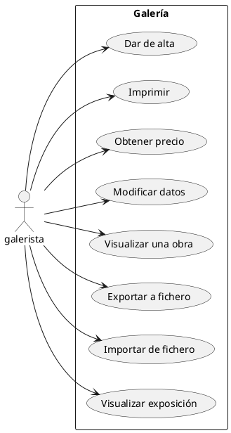

Los **diagramas de actividad** son bastante sencillos y no aportarían demasiada información útil, aquí un ejemplo del diagrama de actividad del caso de uso **"Modificar datos":**

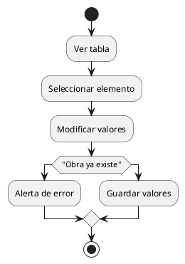

Sin embargo, el caso de uso **"Obtener precio"** es más complejo debido a todas las varibles que tiene, por lo que se ha desglosado en un **ordinograma** el comportamiento de este método:

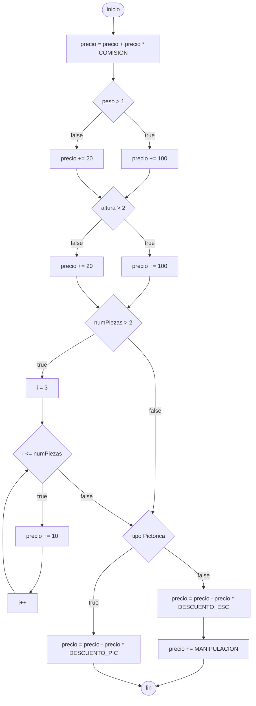

La arquitectura que se va a seguir para esta aplicación es el MVC (Modelo Vista Controlador) que tendrá los siguiente componentes:

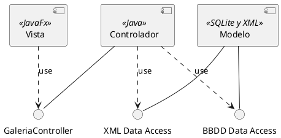

A más bajo nivel se tendrán los siguientes componentes distribuidos en sus correspondientes paquetes **(diagrama de paquetes)**:

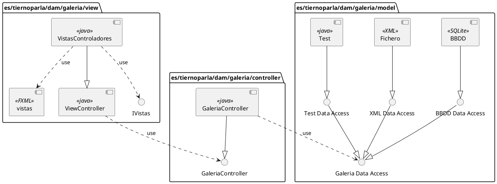

En cuanto al diagrama de clases, el diseño quedaría de la siguiente manera:

```plantuml
@startuml diagrama  de clases 

package es/tiernoparla/dam/galeria/view{
    
    abstract class ViewController {
        #galeriaController: GaleriaController
        +setGaleriaController(GaleriaController controller): void
        +init(List<Obra> lista): void
    }

    class DarAltaPrimController extends ViewController {
        ~irMenu(MouseEvent event): void
        ~irAltaEscultura(MouseEvent event): void
        ~irAltaPintura(MouseEvent event): void
    }

    class DarAltasegController extends ViewController {
        -obras: ObservableList<Obra> 
        ~confirmarAlta(MouseEvent event): void
        ~mostrarAviso(String msg, AlertType tipo): void
        ~irMenu(MouseEvent event): void
    }

    class DarAltaterceController extends ViewController {
        ~confirmarAlta(MouseEvent event): void
        ~mostrarAviso(String msg, AlertType tipo): void
        ~irMenu(MouseEvent event): void
    }

    class ExposicionController extends ViewController {
        +initialize(): void
        ~irMenu(MouseEvent event): void
    }

    class MenuController extends ViewController {
        ~irDarAlta(MouseEvent event): void
        ~irExposicion(MouseEvent event): void
        ~irSeleccionar(MouseEvent event): void
        ~exportar(MouseEvent event): void
        ~mostrarAviso(String msg, AlertType tipo): void
    }

    class ModificarController extends ViewController {
        -obras: ObservableList<Obra> 
        +initialize(): void 
        ~calcularPrecio(MouseEvent event): void
        ~imprimir(MouseEvent event): void
        ~irMenu(MouseEvent event): void
        ~modificar(MouseEvent event): void
        -modificarEscultura(Escultura obra): void
        -modificarPictorica(Pictorica obra): void
        ~visualizar(MouseEvent event): void
        ~seleccionarObra(MouseEvent event): void
        -copiarDatosFormularioEscultura(Escultura obra): void
        -copiarDatosFormularioPictorica(Pictorica obra): void
        -mostrarAviso(String msg, AlertType tipo): void
    }

    interface IVistas {
        +VIEW_MENU: String
        +VIEW_DARALTAUNO: String
        +VIEW_DARALTADOS: String 
        +VIEW_DARALTATRES: String
        +VIEW_MODIFICAR: String 
        +VIEW_EXPO: String 

    }

    ViewController .> IVistas: use

}

package es/tiernoparla/dam/galeria/controller{

    ViewController .> GaleriaController

    class GaleriaController{
        +start(Stage stage): void
        +cerrar(Stage stage): void
        +cargarVista(String ficheroView): ViewController
        +add(Pictorica obra): List<Obra>
        +add(Escultura obra): List<Obra>
        +modify(Escultura obra): List<Obra>
        +modify(Pictorica obra): List<Obra>
        +obtenerObras(): List<Obra>
    }
}

package es/tiernoparla/dam/galeria/model{

    abstract class Obra {
        #UNIDAD_MONEDA_EUR = "EUR": String
        #UNIDAD_ALTURA = "m": String
        #UNIDAD_PESO = "t": String
        +{static}contador: int
        #nombre: String
        #autor: String
        #precio: double
        #altura: double
        #peso: double
        #numeroPiezas: int
        #descripcion: String 
        #tipo: String
        #galeria: String
        #id: int
        +Obra() // Constructor
        +toString() String
        +imprimirEtiqueta(): String
        +getPrecioFinal(): double
        +obtenerComision(): double
        +obtenerPiezas(): double
        +obtenerMsgPiezas(): String
        +obtenerAltura(): double
        +obtenerPeso(): double
        +imprimirPrecio(): String
    }
    class Escultura extends Obra {
        -SOBRECOSTE = 50: double
        -material: String
        +Escultura() // Constructor
        +getPrecioFinalEsc(): double
        +imprimirPrecioEsc(): double
        +getDescuento(): double
    }
    class Pictorica extends Obra {
        -tecnica: String
        +Pictorica() // Constructor
        +getPrecioFinalPic(): double
        +getDescuento(): double
        +imprimirPrecioPic(): double
    }
    class Autor {
        -id: int
        -nautor: String
        -anoNacimiento: int
        -estilo: String
        +Autor() //Constructor
    }
    class Galeria {
        -nombre: String
        -ubicacion: String
        +Galeria() //Constructor
    }

    package es/tiernoparla/dam/galeria/model/BBDD {
        interface GaleriaDAO {
            +obtenerObras(): List<Obra> 
            +add(Pictorica obra): void
            +add(Escultura obra): void 
            +modify(Pictorica obra): void 
            +modify(Escultura obra): void 
        }
        class SQLiteGaleriaDAO implements GaleriaDAO {
            -obtenerIDAut(Obra obra): int
            -crearAutor(Obra obra, int idAutor): void
        }
        class DAOFactory{
            +{static}MODO_TEST = 0: int
            +{static}MODO_SQLITE = 1: int
            +getDao(int modo): GaleriaDAO
        }
        class TestGaleriaDAO implements GaleriaDAO {
            -lista: List<Obra>
            +obtenerObras(): List<Obra>
        }
    }

    package es/tiernoparla/dam/galeria/model/XML {
        interface GaleriaXMLDAO {
            +importar(): void
        }
        class SQLiteXMLGaleriaDAO {
            +add(Autor autor): void
            +add(Escultura escultura): void
            +add(Escultura obra): void
            +add(Pictorica pictorica): void
            +add(Galeria galeria): void
            +obtenerIDAut(Obra obra): int
            +crearAutor(Obra obra, int idAutor): int
        }
        class DAOFactoryXML {
            +{static}MODO_TEST = 0: int
            +{static}MODO_XML = 1: int
            +getDao(int modo): GaleriaXMLDAO
        }
        class XMLGaleriaDAO implements GaleriaXMLDAO {}
        class TestXMLGaleriaDAO implements GaleriaXMLDAO {}
    }
    


}

GaleriaController ..> DAOFactory: use
GaleriaController ..> DAOFactoryXML: use
GaleriaDAO <. DAOFactory: use
Galeria "0..1" o-- "1..*" Obra 
Autor *-- "1..*" Obra 
Obra ...> GaleriaDAO: use
Obra ..> GaleriaXMLDAO: use
DAOFactoryXML .> GaleriaXMLDAO: use
SQLiteXMLGaleriaDAO ..> GaleriaXMLDAO: use 

@enduml
```

Para los prototipos de la interfaz de usuario se ha usado el *software* Pencil, y han quedado diseñados de la siguiente manera (ver imágenes):

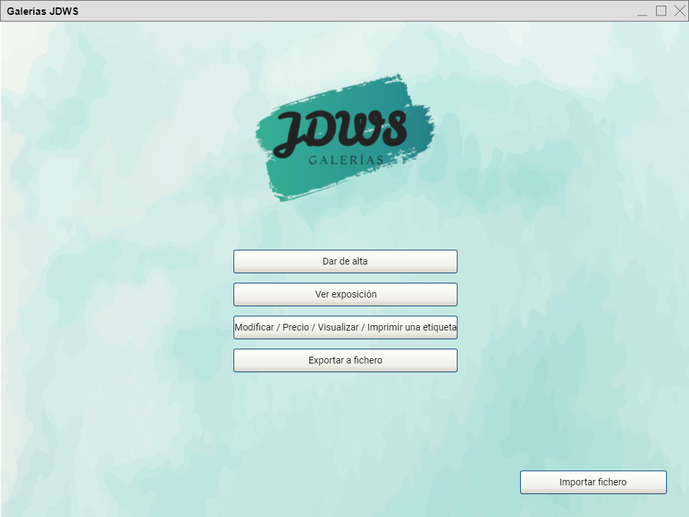
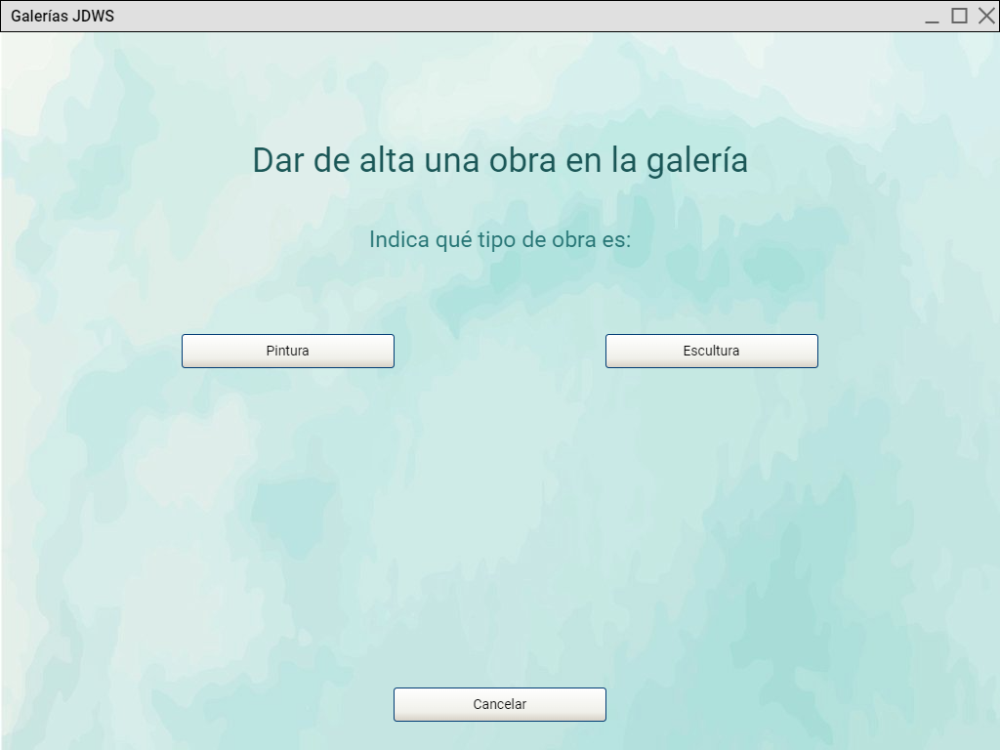
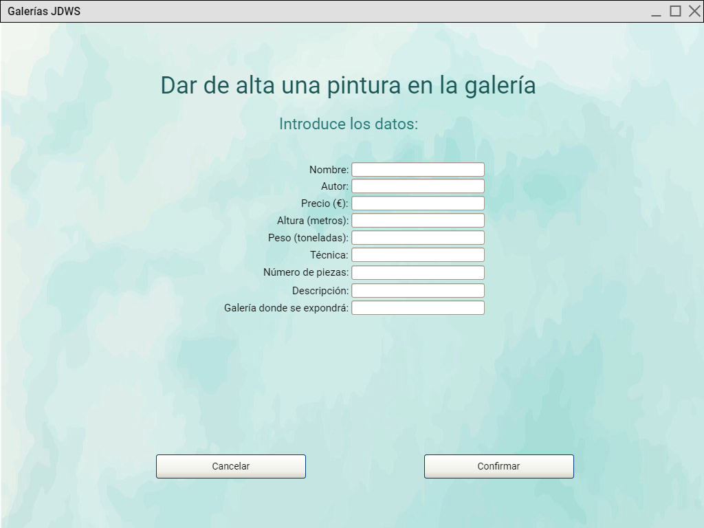
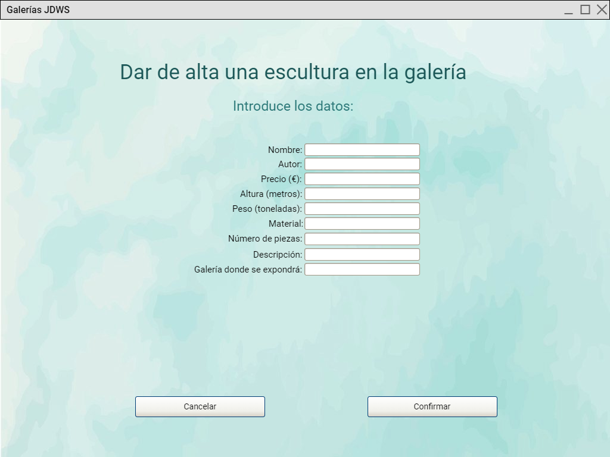
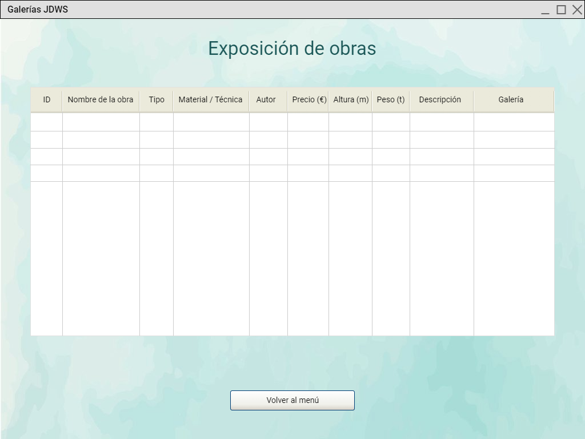
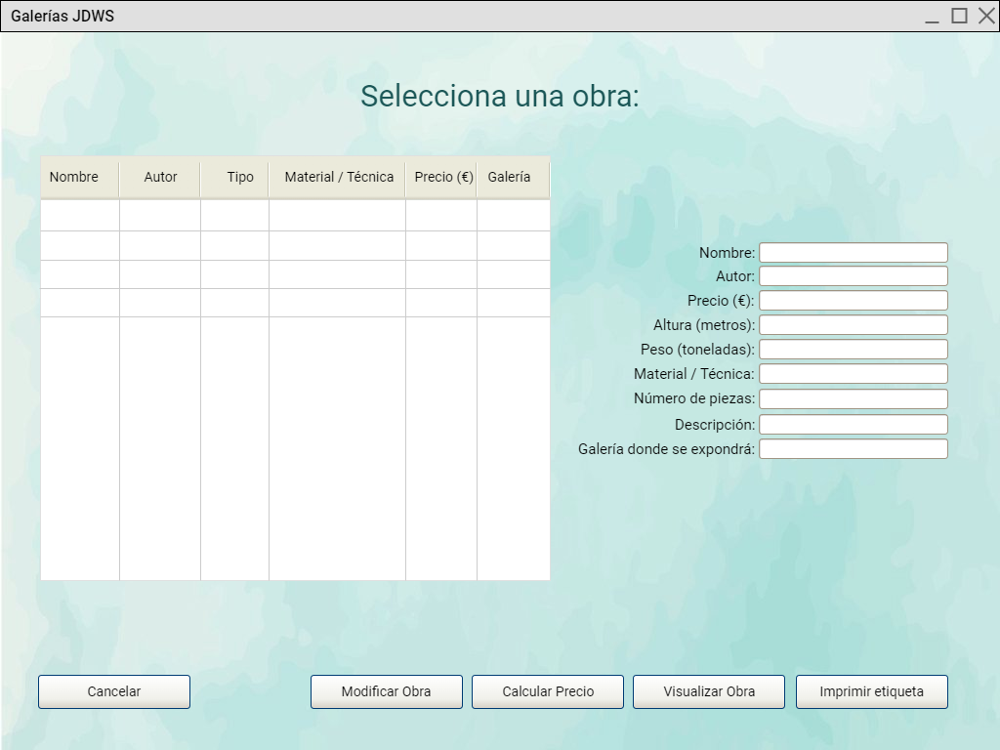

Y el diagrama de navegación entre estas distintas pantallas queda de la siguiente manera:

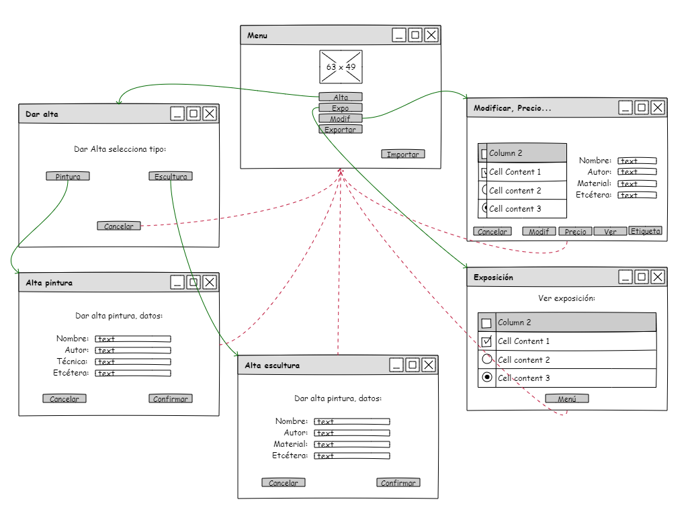


## Diseño de las pruebas

Para los **métodos "getPrecioFinalPic" y "getPrecioFinalEsc"**:

Constantes para estos métodos:

|Constante|Valor|
|--|--|
|Comisión|+25%|

Variables que se tienen que tener en cuenta: precio inicial de la obra, peso, altura, número de piezas y tipo de obra.
Valores:

|Variable|Rango|Precio|
|--|--|--|
|Precio inicial|-|(0, infinito)|
|Peso|[0, 1]|+20|
|Peso|(1, infinito)|+100|
|Altura|[0, 2]|+20|
|Altura|(2, infinito)|+100|
|Num piezas|[0, 2]|0|
|Num piezas|(2, infinito)|+10/pieza|
|Tipo Pintura|-|-10%|
|Tipo Escultura|-|-20%|
|Tipo Escultura|-|+50|

Según estos datos, se pueden tener los siguientes casos de prueba para estos métodos (los valores límite y más representativos), donde al precio inicial de la obra se le da valor 100 en todos los casos:

|CP|Variables-Entradas| | | | |Salidas|
|--|--|--|--|--|--|--|
| |Precio inicial|Peso|Altura|Num Piezas|Tipo|
|CP1|100|1|1|2|Pintura|148.5|
|CP2|100|2|1|1|Pintura|220.5|
|CP3|100|1|3|1|Pintura|220.5|
|CP4|100|1|2|1|Pintura|148.5|
|CP5|100|1|1|1|Pintura|148.5|
|CP6|100|1|1|4|Pintura|166.5|
|CP7|100|1|1|0|Escultura|182|
|CP8|100|1|2|1|Escultura|246|
|CP9|100|1|3|1|Escultura|246|
|CP10|100|1|2|1|Escultura|182|
|CP11|100|1|1|1|Escultura|182|
|CP12|100|1|1|4|Escultura|198|

### Pruebas

Implementadas con JUnit en la clase ObraTest. Las 12 pruebas realizadas a los métodos getPrecioFinalPic y getPrecioFinalEsc han sido correctas.

# Workstation

**Sistema operativo:** Windows 11.
**Entorno de desarrollo:** Visual Studio Code versión 1.78.2.
**Extensiones del entorno que han ayudado al desarrollo del proyecto:** Extension Pack for Java, JavaFX Support, Markdown All in One, Markdown Preview Enhaced, Markdown Preview Mermaid Support, Maven for Java, PlantUML.
**Versión de Java:** JDK 19
**Versión de JavaFX:** 20.0.1
**Base de datos:** SQLite.
**Formato de los ficheros de importación:** XML.
**Formato de los ficheros de exportación:** XML.

### Análisis y diseño:

**Requisitos:** evaluación del caso y discusión grupal.
**Diagramas:** UML para casos de uso, diagramas de actividad, de componentes y de clases.
**Ordinogramas:** Mermaid.
**Diagrama de navegación de los prototipos:** Pencil.
**Documentación del código:** JavaDoc.
**Documentación de la solución:** fichero de texto en Markdown donde se recogen todas las observaciones y se encuentra cada fase del proyecto detallada. También hay una carpeta aparte (/doc) donde están recogidos cada uno de los diagramas y apartados por separado para facilitar la consulta y la modificación de los mismos.

**Prototipos:** diseñados con Pencil.
**Interfaz gráfica:** desarrollada e implementada con SceneBuilder y JavaFX.

**Pruebas**: JUnit 5.