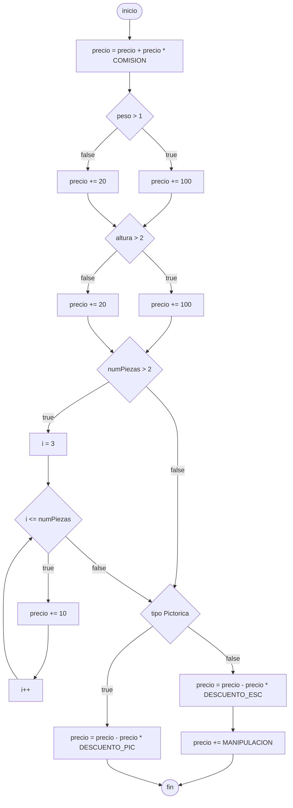

```mermaid
flowchart TD
A([inicio]) --> B[precio = precio + precio * COMISION]
B --> C{peso > 1}
C --> |true| D[precio += 100]
C --> |false| E[precio += 20]
D --> F{altura > 2}
E --> F
F --> |true| G[precio += 100]
F --> |false| H[precio += 20]
G --> I{numPiezas > 2}
H --> I
I --> |true| J[i = 3]
J --> K{i <= numPiezas}
K --> |true| L[precio += 10]
L --> M[i++]
M --> K
I --> |false| N{tipo Pictorica}
K --> |false| N
N --> |true| O[precio = precio - precio * DESCUENTO_PIC]
N --> |false| P[precio = precio - precio * DESCUENTO_ESC]
P --> Q[precio += MANIPULACION]
Q --> R([fin])
O --> R

```